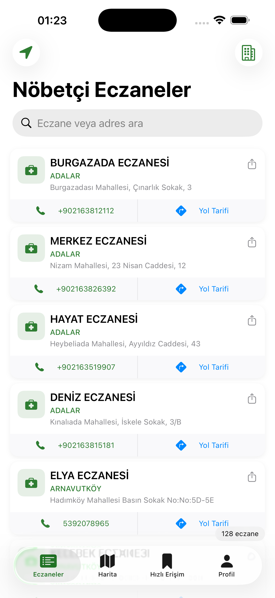
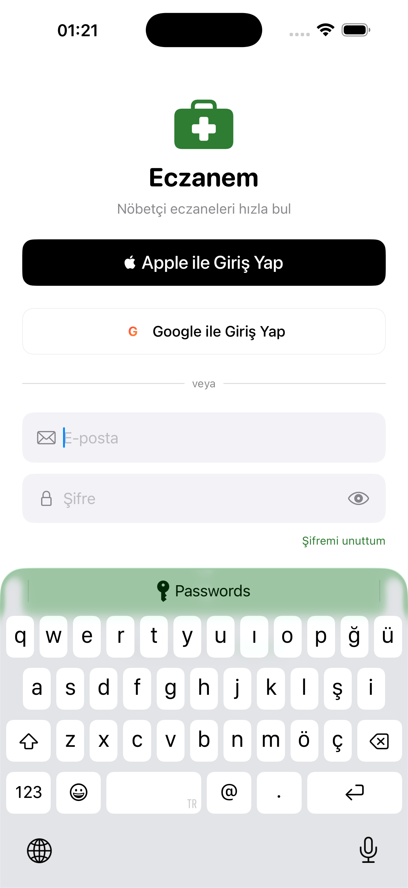
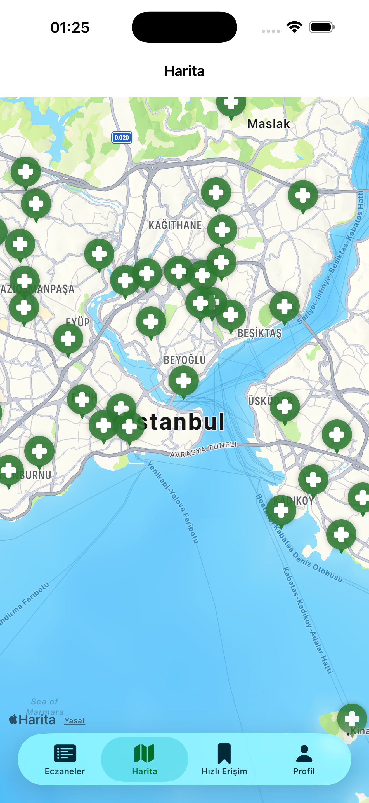
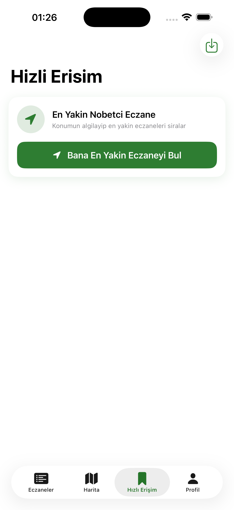
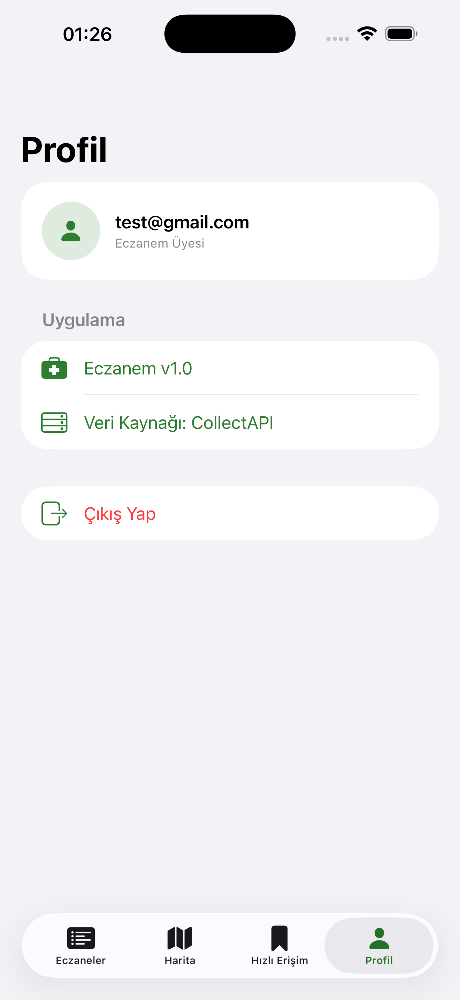

<p align="center">
  
</p>

<h1 align="center">Eczanem 💊</h1>

<p align="center">
  Türkiye'deki nöbetçi eczaneleri anında bulun — GPS destekli, hızlı ve güvenilir.
</p>

<p align="center">
  
  
  
  
  
</p>

---

## 📱 Ekran Görüntüleri

<p align="center">
  
  
  
  
  
</p>

---

## ✨ Özellikler

| Özellik | Detay |
|---|---|
| 📍 **GPS ile Otomatik Konum** | Telefon konumunu alarak ilini/ilçeni otomatik saptar |
| 🏥 **En Yakın Eczane** | GPS aktifken eczaneler mesafeye göre sıralanır, en yakına "EN YAKIN" rozeti verilir |
| 🗺️ **Harita Görünümü** | Tüm nöbetçi eczaneleri haritada pinler üzerinde gösterir |
| 📞 **Arama** | Tek tuşla eczaneyi ara (onay dialogu ile) |
| 🧭 **Yol Tarifi** | Apple Maps üzerinden sürüş yönlendirmesi |
| ⚡ **Hızlı Erişim** | Sık ziyaret ettiğin şehirleri kaydet, tek tuşla yükle |
| 🔍 **Arama & Filtreleme** | İsme veya adrese göre filtrele |
| 🔐 **Güvenli Giriş** | E-posta, Apple Sign In ve Google Sign In |
| 🌙 **Dark Mode** | Tam iOS Dark Mode desteği |
| 📤 **Paylaşım** | Eczane bilgilerini arkadaşınla paylaş |

---

## 🏗️ Mimari

```
Eczanem/
├── App/
│   └── EczanemApp.swift          # @main, Firebase başlatma, Google URL handler
├── Models/
│   ├── Pharmacy.swift            # Eczane veri modeli
│   └── AppErrors.swift           # Hata türleri (Türkçe açıklamalar)
├── Services/
│   ├── PharmacyService.swift     # CollectAPI HTTP katmanı
│   ├── LocationService.swift     # CoreLocation async/await wrapper
│   └── QuickLocationsService.swift # UserDefaults kayıtlı konumlar
├── ViewModels/
│   ├── PharmacyViewModel.swift   # Eczane listesi, önbellek, mesafe sıralama
│   └── AuthViewModel.swift       # Firebase Auth (Email/Apple/Google)
├── Views/
│   ├── Auth/                     # Giriş, Kayıt, Şifremi Unuttum, Splash
│   ├── Pharmacy/                 # Liste, Harita, Satır bileşeni
│   ├── QuickLocationsView.swift  # Hızlı Erişim sekmesi
│   └── MainTabView.swift         # Tab yönetimi
└── Core/
    └── Persistence/              # Core Data (genişleme için hazır)
```

**Pattern:** MVVM + Service Layer  
**Async:** Swift Concurrency (async/await, CheckedContinuation)  
**State:** ObservableObject + @Published + Combine  

---

## 🛠️ Teknoloji Yığını

- **SwiftUI** — iOS 16+ declarative UI
- **Firebase Auth** — E-posta, Apple ve Google Sign In
- **CollectAPI** — Türkiye nöbetçi eczane verisi ([collectapi.com](https://collectapi.com/api/health/pharmaciesApi))
- **CoreLocation** — GPS konum + reverse geocoding
- **MapKit** — Harita görünümü
- **Core Data** — Yerel veri kalıcılığı (genişleme için)
- **XcodeGen** — Kod tabanlı Xcode proje yönetimi

---

## ⚙️ Kurulum

### Ön Gereksinimler

- Xcode 15+
- iOS 16+ cihaz veya simülatör
- [XcodeGen](https://github.com/yonaskolb/XcodeGen) (`brew install xcodegen`)
- CollectAPI hesabı ([collectapi.com](https://collectapi.com))
- Firebase projesi ([console.firebase.google.com](https://console.firebase.google.com))

---

### 1. Repoyu Klonla

```bash
git clone https://github.com/KULLANICI_ADIN/eczanem-ios.git
cd eczanem-ios
```

### 2. Gizli Yapılandırmaları Ayarla

**CollectAPI anahtarı:**

```bash
cp Configurations/Secrets.xcconfig.example Configurations/Secrets.xcconfig
```

`Configurations/Secrets.xcconfig` dosyasını aç ve kendi API anahtarını gir:

```
COLLECT_API_KEY = BURAYA_KENDI_COLLECTAPI_KEYINI_YAZ
```

**Firebase yapılandırması:**

```bash
cp Eczanem/GoogleService-Info.plist.example Eczanem/GoogleService-Info.plist
```

Firebase Console'dan indirdiğin `GoogleService-Info.plist` dosyasıyla değiştir.

> Firebase Console → Project Settings → İOS uygulaması → GoogleService-Info.plist indir

### 3. Firebase'i Yapılandır

Firebase Console'da şu sağlayıcıları etkinleştir:
- Authentication → **E-posta/Şifre** ✓
- Authentication → **Apple** ✓
- Authentication → **Google** ✓

### 4. Xcode Projesini Oluştur

```bash
xcodegen generate
```

### 5. Projeyi Aç ve Çalıştır

```bash
open Eczanem.xcodeproj
```

Xcode'da hedef cihazı seç → **Cmd+R**

---

## 🔐 Güvenlik

Bu repo **hiçbir gerçek kimlik bilgisi içermez.**

| Dosya | Durum | Neden |
|---|---|---|
| `GoogleService-Info.plist` | `.gitignore`'da | Firebase API key ve proje bilgileri |
| `Configurations/Secrets.xcconfig` | `.gitignore`'da | CollectAPI anahtarı |
| `Info.plist` | Commit edilmiş ✓ | Sadece `$(COLLECT_API_KEY)` placeholder içerir |

Kendi fork'unu public yapmadan önce `git log` ve `git diff` ile yanlışlıkla commit edilmiş anahtar olmadığını doğrula.

---

## 📡 API

Eczane verileri [CollectAPI](https://collectapi.com/api/health/pharmaciesApi) üzerinden çekilir.

```
GET https://api.collectapi.com/health/dutyPharmacy?il=Ankara&ilce=Çankaya
Authorization: apikey YOUR_KEY
```

**Rate limit notu:** CollectAPI ücretsiz planda istek limiti uygulamaktadır. Uygulama aynı il/ilçe için 5 dakikalık önbellek kullanır.

---

## 🤝 Katkıda Bulunma

1. Fork'la
2. Feature branch oluştur: `git checkout -b feature/yeni-ozellik`
3. Değişikliklerini commit'le: `git commit -m 'feat: yeni özellik ekle'`
4. Push'la: `git push origin feature/yeni-ozellik`
5. Pull Request aç

---

## 📄 Lisans

MIT License — detaylar için [LICENSE](LICENSE) dosyasına bak.

---

<p align="center">
  Türkiye'deki tüm hastalar için ❤️ ile yapıldı
</p>
